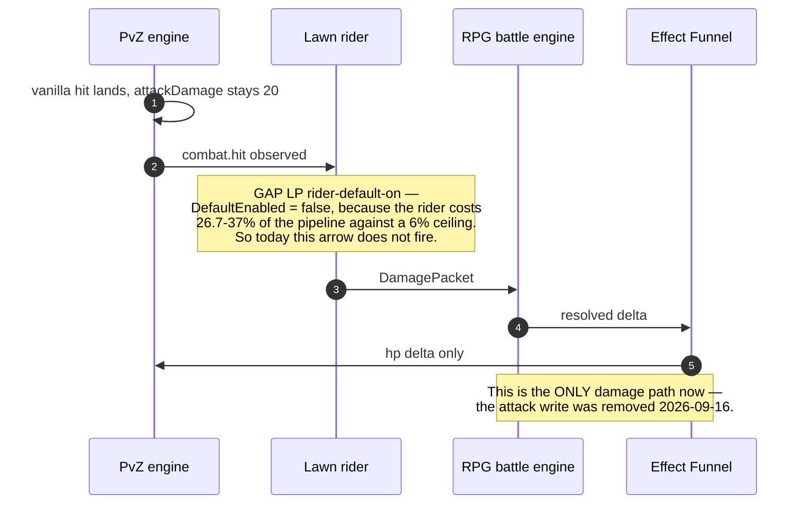

# `species-hub-wire` — the ideal

**Status:** ⛔ **SUPERSEDED 2026-09-16 by [actor-layer-compose-ideal.md](actor-layer-compose-ideal.md).**
Kept as the reasoning trail, not as guidance — every measurement below still holds and is carried
forward; the FRAME was wrong. This doc treats the species seed as a feature to wire. It is one layer of
one compose, and the compose is the subject: the program exists so that one ActorHub composes an actor's
numbers once, for every mode, honestly enough to answer "how strong is this creature?". Read the
successor first; come here only for the measurements and the reasoning that produced them.

Original status line: idea phase, 2026-09-16. Not a spec. No build authorized.
**Owner framing:** *"wire the species seed to the actor hub correct, 2 feature is made but not wired
correctly."* Both features were found, and both are measurable — the numbers below come from the live
store and the committed corpus, not from reading comments.

---

## Which loop this extends

[`the-loops.md`](../guide/the-loops.md) **A. Level up and power** — whose own status line already says
*"species builds and meters **WIP**"*, and whose text is the promise this doc is about:

> *"Dave's level is the main line. **Specimens, species, and types also level from work they did.**"*

Secondarily **B. Creature summon and fusion** — a summoned specimen is an instance of a species, and
what its species *is* should be what makes one pull feel different from another.

No new loop. No parallel pitch.

## The principles this doc is bound by — restated, not linked

A downstream session reads this page, not its links.

1. **Every RPG feature lives in the RPG layer. It is never built by changing what PvZ is.** A species'
   stats reach the lawn as RPG-layer contributions folded into the actor's composed numbers; PvZ is
   never asked to know what a species is.
2. **One `ActorHub` compose, one read.** Lawn, sheet, battle, delve, siege and sim compose once, in
   `ActorHub`. Anything new **contributes** through a registered `IActorStatSubsystem` / atom reader, or
   **consumes** Hub output. A second fold of the same numbers is the `BattleStatComposer` defect that was
   overturned and deleted — never a pattern to copy.
3. **One power ladder.** Contests read `Θ`; magnitudes read `P(Θ)`. `ssot-power-scale.md` §10 is a closed
   inventory — a new `f(level)` is the defect it exists to end.
4. **Seed → concrete → per-player.** The seed is generator input, not rows. Species *stats* are
   deterministic and shared; only *effects* roll, per player, at runtime.
5. **Generated data is never hand-edited.** `gk-data/packs/fusion/data/generated/creatures/**` is output — a fix goes into the
   generator and is regenerated, or it is reverted by the next run.
6. **The balance surface is data**, in `gk-core/data/tuning/<domain>.v{n}.json`, published as `v{n+1}`.
7. **A guardrail validates the contract and closed enums — never a population count.** "904 species" is a
   reading, not a constant.

---

## What this is, in the player's language

You summon a Peashooter and a BigGloom. They should not be the same creature with a different picture.
Today, on the lawn, they are: a specimen's species contributes **nothing** to its composed stats, and the
one species mechanic that does reach the Hub accrues **47× faster for the zombies than for your plants**.

## What already exists — three buckets

### Built

| What | Where | What proves it |
|---|---|---|
| The whole seed → concrete → import chain for species | `SpeciesExpander`, `ConcreteSpeciesSerializer`, `RpgStore.Species.cs:156` | **904** species imported, **11,724** rows in `creature_species_magnitude`, every one of the 904 carries magnitudes |
| The species-magnitude **binding reconciler**, run on every deploy | `RpgStore.UniqueActors.cs:1588` `ReconcileCreatureMagnitudeBindingsUnlocked` | Complete: withdraws stale, binds wanted, fails closed, revision-aware |
| Species **aptitude allocation** registered on the injector's Hub | `CheatState.cs:55` (`aptitudeAllocation: SpeciesAllocation.Resolve`) | Live trace on a real board: `bonusAtkContribs "aptitude.Might:Flat:133;aptitude.Ferocity:Flat:80"` on a zombie |
| Species **XP**, both sides, both terms | `RpgXpAwardMap.cs:92` (placement) · `RpgStore.Progression.cs:79` (run completion) | Live: `species XP by reason {zombie_spawn: 47985, species_run_complete: 8484, plant_place: 1030}` |
| The **provenance claim** that gates a species award | `EntityApply.cs:289` stamps it only for vanilla lifecycle sources (`start`, `initHealth`) | Correct by design — a debug spawn is not evidence |
| Species-passive **materialiser** (per-player rolled effects) | `SpeciesMaterialiser.cs:51` | Rolls `species-passive.{speciesId}` per player |

### Wiring gap

**W1 — a specimen's species base stats reach nothing. The container they bind through does not exist,
for any species.**

`ReconcileCreatureMagnitudeBindingsUnlocked` looks up `trait.species-magnitude-{speciesId}`
(`RpgStore.UniqueActors.cs:1569`) and, finding none, returns at `:1619` — *"seeded species-magnitude
container missing; fail closed"*.

| Reading | Value |
|---|---|
| Species with magnitude data in the store | **904 of 904** |
| `trait.species-magnitude-*` containers in the store | **0** |
| Seed files anywhere in `gk-data/packs/fusion/data/seed/**` mentioning `species-magnitude` | **0** |
| `effect_binding` rows with source `creature-magnitude` | **0** (live sources are only `debug`, `demon-trait`, `derived-audit`, `equip-assign`) |

So the reconciler has never bound anything, for any specimen, since it shipped. **This is an inert line
of code, not an architectural limit** — the data exists, the binder exists, the atom fold that would
carry it into the Hub exists. The only missing piece is the content the binder looks for.

**W2 — the species build accrues on the wrong side of the lawn.**

The allocation path is wired end to end and demonstrably works. What it is fed is the problem. Species XP
has two terms (`gk-core/data/tuning/species-progression.v1.json`): `runCompletion: 100`, once per resolved match a
species was fielded in, and `placement: 4`, per place/spawn. Its own `_note` records the sizing argument:

> *"Sized so runCompletion (100) still exceeds even a heavy same-species spam match (20 placements ×
> placement(4) = 80 < 100)"*

That reasoning holds for **plants**, whose placements the player pays sun for and the board bounds by
cells. It does not hold for **zombies**, whose spawn count the host game decides and nothing bounds.
Measured over the whole store:

> ⚠️ **Re-measured 2026-09-18.** The store has been reset since these figures were taken, so both
> columns below are readings with a date, never constants. The **skew is the finding, not the
> magnitude**, and it survived the reset intact.

| Reason | Species XP — 2026-09-16 | Species XP — 2026-09-18 | Ledger rows — 2026-09-18 |
|---|---|---|---|
| `zombie_spawn` | **47,985** | **26,424** | 6,606 |
| `species_run_complete` | 8,484 | 7,500 | 75 |
| `plant_place` | **1,030** | **824** | 206 |

**47×**, on the term that was sized assuming 20. In one account the result is `normalzombie` at **level
52** against `peashooter` at **level 2** — and since the `CreatureType` point budget is a function of
species level, the player's own plants have almost no species build while the enemy's have a large one.

This is a **wiring gap in the faucet, not in the transport**: every wire is connected and carrying; it is
connected to a source whose rate the player does not control.

**W3 — the per-player rolled species effects exist for 3 of 904 species, at a stale revision.**

| Reading | Value |
|---|---|
| `species-passive.*` containers | **3** — `conezombie`, `peashooter`, `sunflower` (the pilot batch) |
| `player_species` rows | **3**, all player 1 |
| Their `catalog_revision` | **8**, while the store is at **12** |

The materialiser is built and proven; the corpus behind it is a pilot.

⛔ **W3 is retired by the owner ruling of 2026-09-16** (see "The layer model" below). The per-player roll
was the *first* idea for species identity — random stats per game — and the owner has withdrawn it: the
building systems already carry that variety. So this is not a corpus to grow. The `species-passive.*` id
is reused for the deterministic layer 1, and the numbers above become the cleanup list: 3 stale
`player_species` rows at `catalog_revision 8`, and the fusion picks that write them.

### Real gap

**R1 — no stage of any generator emits `trait.species-magnitude-*` containers.** The generator writes
magnitudes into `gk-data/packs/fusion/data/generated/creatures/*.json`; the importer writes them into
`creature_species_magnitude`. Nothing turns them into the atom containers the binder consumes. That
middle step has never existed — it is a genuinely missing generator stage, and it is the only real gap in
this whole feature.

**R3 — plant/zombie TYPE progression feeds nothing at all.** Owner, 2026-09-16: *"the current
progression for plant/zombie type only have level, so if player play the game, the general species spawn
in game never earn progression or buff."* Confirmed in code, and it is the sharpest finding on this page:

- `RpgProgressionSubsystem.ContributeDerived` (`RpgProgressionSubsystem.cs:43-54`) adds exactly **two**
  modifiers: `progression.power` — which is `Θ` from `IPowerIndexProvider.ActorIndex`, i.e. **Dave's**
  level — and `progression.realm`, a permanent stub constant. Nothing else.
- Its own doc comment records that the level-gated `progression.bonus.{maxHp,atk,defense}` curve it used
  to own was **retired** (class-system P3.3, 2026-08-27) and those channels are allocation-sourced now.
- Nothing under `gk-core/src/FusionRpg.Core/Stats/**` or `gk-fusion/src/FusionRpg.Injector/**` reads a
  `rpg_actor_progression` row of kind `plant`/`zombie`. The only consumers are display summaries
  (`RpgStore.Progression.cs:354-357, 364-365, 616-617`) and the XP curve that writes them
  (`RpgProgression.cs:70-71`). ⚠️ `EntityBaseline.PlantLevel` is **vanilla PvZ's own** plant level, not
  this row — do not mistake one for the other.

So a plant type at level 4 composes exactly as a plant type at level 1. The XP is real, the level is
real, and **no stat anywhere reads it.** 28 plant rows and 13 zombie rows in the live store are, today,
a number on a screen.

**R2 — there is no species-XP source that measures *work done* rather than *appearances*.** The loops doc
promises *"species … level from work they did"*. Both shipped terms count appearances: one per spawn, one
per match fielded. Nothing counts what the species actually did — damage dealt, kills, waves survived.

---

## What a general spawn actually composes today — and why yesterday's live run could not see it

Owner, 2026-09-16, on the live run: it *"not work on real game because species and empire progression
system never made."* The measurement agrees on three of four points, and the fourth is worth stating
precisely because it changes what has to be built.

| Contribution a general (PvZ-engine-spawned) actor receives | State |
|---|---|
| `Θ` / `progression.power` | **Player-wide.** Dave's level. Identical for every actor on the board, both sides. |
| Commander aptitude allocation | **Player-wide**, and frozen to a snapshot for the match. |
| **Species** aptitude allocation (`CreatureType` scope) | **Real, and it does vary per species** — `SpeciesAllocationSource.Resolve:105-117` returns `commander + speciesAllocation(speciesId)` for any entity with no Bound instance. Live proof: a plain zombie on player 7 carried `aptitude.Ferocity:Flat:80` while that player's commander allocation held no Ferocity at all. |
| Plant/zombie **type** level | **Nothing** (R3). |
| **Species base magnitudes** — the species' own hp/atk/range identity | **Nothing** (W1 — 0 of 904 containers). |
| **Empire** scope | **Does not exist.** `AllocationScope` is `{Commander, CreatureType, Aspect, UniqueCreature}` (`AptitudeAllocation.cs:8`). "Empire species" is a *fallback label* in `creature-scope-ideal.md:48`, not a scope; both reserved carriers are idle — `world-map-scope` is Draft, and `ContainerKind.WorldBuff` has **0** authored rows anywhere in `gk-data/packs/fusion/data/seed/**`. |

So the honest statement is **not** "a general spawn earns no progression or buff" — it earns one, through
the species aptitude scope. It is: **a general spawn's buff carries no species identity and no type
progression.** Two plants of different species, at the same Θ, differ only by whatever the species
aptitude allocation happens to be — and that allocation is gated on species level ≥ 2 (budget is 0 at
level 1) and fed by the 47×-skewed faucet of W2.

**And yesterday's live run could not have caught any of this.** T14/T15 drove a **Bound specimen**, which
takes the *unique* branch at `SpeciesAllocationSource.Resolve:98-103` and returns
`commander + uniqueAllocation` — it never reaches the species lookup on line 105. The general-species
path is untouched by every proof this repo has run so far. Any module here owes a live reading on a
**plain PvZ-spawned actor**, not on a deployed specimen.

## ⭐ The layer model, 2026-09-16 — N derived-stat containers, summed in Hub

Owner, correcting this doc's earlier framing:

> *"Specie seed carry base species stats, this is first derived stats container (atom effect container).
> The progression is second derived stats container. Item equipment, passive tree, title system, aura,
> buff, and more. They are multiple layer and sum together. So when a actor deploy, they need to resolve
> in actor hub."*

So the model is not "a base plus a progression". It is a **stack of atom-effect containers**, each bound
to the actor, all folded by the one `DerivedComposer` inside `ActorHub`. Four of the layers already work
this way — the architecture is right, the content and two carriers are what is missing.

| # | Layer | Carrier | State |
|---|---|---|---|
| 1 | **Species base stats** (from the species seed) | container, bound at deploy — see the ruling below | **0 authored of 904** |
| 2 | **Progression** | ⛔ carrier not yet named — see open question 2 | today it arrives as aptitude allocation math, not a container |
| 3 | Item equipment | `equip-assign` bindings → `EquippedBoundAtoms` | works |
| 4 | Passive tree | `TreeBoundAtomsCache` | works |
| 5 | Title system | `achievement-title` worktree | separate program |
| 6 | Aura / patron | `patron.aura` container | works |
| 7 | Buff / status | `StatusDerivedMods` → Hub `status.*` | works |
| … | and more | | |

### Deployment scope — read from `deployment-hierarchy-ideal.md` (empire-development worktree)

A deployment is a **scope with a lifetime**, and the layers resolve into Hub inside it:

- **parent** = where a force lives (home roster · legion in a sector · garrison · delve party · expedition
  muster). **child** = where it deploys (lawn Bound · siege combatant · delve slot · expedition seat).
- At deploy the child **inherits a snapshot**: the six pool values, status *specs* (re-applied at the
  child's first tick, never pre-applied), and sticky flags (`Downed`/`DownedOnce`, `NerveStacks`,
  `Wounds`, phase — `Roster` required, `ActiveBound`/`Recovering` refuse).
- **Does not cross:** live `StatusRuntime` instances, Unity `ptr`s (rebound per child), the match-scoped
  sun bank, the three stocks.
- **Settle** is exactly-once per `(parentId, childId)`. Lawn die / board end → `ActiveBound → Roster` plus
  the specimen XP ledger and wounds — the same path `lawn-combat-wire` L-N40 repaired.
- The binding rule, verbatim: *"Every combat read goes through ActorHub. Children contribute … or
  consume Hub output. **No child invents a composer.**"*

**Consequence for this program:** a **general** spawn and a **unique** specimen resolve *identically* —
same Hub, same layer stack. They differ only in which parent they deploy from and which container fills
layer 2. Troops stay troop-stack counts and never become N `UniqueActor` rows.

### ⛔ `species-passive.{speciesId}` is retired as a roll and reused as layer 1 (owner, 2026-09-16)

> *"species-passive.{speciesId} it is stale, my first idea is make species random stats each game but i
> wrong. We dont need it, we already have strong building systems. So retire or reuse it for our demon
> specie base stats."*

**Measured before recommending, and it makes the choice cheap: the per-player roll is already dead
weight.** `SpeciesMaterialiser` rolls `species-passive.{speciesId}` into `player_species` (3 rows, player
1, at `catalog_revision 8` against a store at 12) — and **nothing binds a `player_species` instance to
any actor**. Its only readers are fusion's own "already materialised" guard
(`RpgStore.Fusion.cs:237`) and fusion's picks write (`:311-369`). So a player's fusion **picks are
recorded and never reach a stat**. The mechanism the owner is retiring had no consumer to lose.

**Recommendation — reuse the id, keep the binder, retire the roll:**

1. **Layer 1's container id becomes `species-passive.{speciesId}`.** It is the correctly-named kind
   (`ContainerKind.SpeciesPassive`, already a validated prefix in `ContainerValidator`), and it says what
   the container is. The current id `trait.species-magnitude-{speciesId}`
   (`RpgStore.UniqueActors.cs:1569`) squats in the **trait** namespace, which a *sibling* reconciler
   already owns for a species' actual `TraitIds` — two different things under one prefix.
2. **Keep `ReconcileCreatureMagnitudeBindingsUnlocked` exactly as it is.** It is complete and correct:
   binds at every deploy to `OwnerKind.UniqueActor`, withdraws stale, is catalog-revision aware, fails
   closed on missing content, and enforces the double-grant invariant. It has never fired only because
   nothing authored its content. Repointing it is a one-line change to `SpeciesMagnitudeContainerId`.
3. **Author the 904 containers from the generator** (R1) — deterministic and shared, per the standing
   rule that species *stats* are deterministic while only *effects* roll. With the roll retired, nothing
   about a species is random any more, which is the ruling.
4. **Retire `SpeciesMaterialiser`, `player_species`, and the fusion picks write** — or repoint the picks
   at a carrier that is actually read. ⚠️ This is the one real dependency: fusion picks are a shipped
   player-facing choice, and retiring the table silently would delete the only record of them. Name it,
   do not fold it in.

## The wire, end to end — every gap on one page

Collected 2026-09-16 from this session's measurements across five programs. Each gap names its owning
program, so nothing here duplicates a map: `SHW` = this doc, `LP` = [lawn-playable](lawn-playable-map.md),
`LTP` = [lawn-tuning-profile](lawn-tuning-profile-map.md), `LCW` = lawn-combat-wire, `LPR` = live-probe.

### Pipeline 1 — a creature spawns and gets its numbers

```mermaid
sequenceDiagram
    autonumber
    participant PvZ as PvZ engine
    participant INJ as Injector EntityApply
    participant HUB as ActorHub compose
    participant SEED as Species seed 904 rows
    participant W as EntityStatWriter

    PvZ->>INJ: spawn, source=start
    INJ->>HUB: StatContext, baseline from Unity fields
    Note over INJ,HUB: GAP SHW base layer — general reads vanilla 20/300,<br/>unique reads BattleRuleset.BaseHp level.<br/>Same creature, two different bases.
    HUB->>SEED: species base stats
    Note over HUB,SEED: GAP SHW W1 + R1 — 0 of 904 magnitude containers,<br/>no generator stage emits them,<br/>binder fails closed, has never fired.
    HUB->>HUB: progression.power = theta from Dave level
    Note over HUB: GAP SHW R3 — plant/zombie TYPE level feeds nothing.<br/>Only theta and a realm stub contribute.
    HUB->>HUB: aptitude fold, commander + species
    Note over HUB: GAP LP P1 — fresh compose per call, 1624 us avg,<br/>261 channels, per hit, on the main thread.
    HUB->>W: composed final values
    W->>PvZ: hp, maxHp, and 11 more plant fields
    Note over W,PvZ: GAP SHW transport — absolute writes,<br/>13 plant / 12 zombie fields.<br/>Ruling says delta over hp, armor1, armor2 only.<br/>Attack half FIXED 2026-09-16; hp/armour half open.
```

### Pipeline 2 — the species earns its progression

```mermaid
sequenceDiagram
    autonumber
    participant PvZ as PvZ engine
    participant INJ as Injector EntityApply
    participant SRV as Server ingest
    participant XP as RpgXpAwardMap
    participant PROG as rpg_actor_progression
    participant ALLOC as CreatureType allocation
    participant HUB as ActorHub

    PvZ->>INJ: plant placed / zombie spawned
    INJ->>SRV: activity fact plus empire-general claim
    Note over INJ,SRV: Claim stamped only for source=start or initHealth.<br/>Debug spawns excluded — correct by design.
    SRV->>XP: PlantPlaced / ZombieSpawned
    XP->>PROG: type award plus species award
    Note over XP,PROG: GAP SHW W2 faucet skew —<br/>zombie_spawn 26,424 XP vs plant_place 824 (2026-09-18).<br/>32x, on a term sized assuming 20 placements.<br/>Was 47x on 2026-09-16; a reading, not a constant.
    PROG->>ALLOC: species level to point budget
    Note over PROG,ALLOC: Budget is 0 at level 1, so a rarely-placed<br/>plant species contributes nothing.
    ALLOC->>HUB: allocation for this species
    Note over ALLOC,HUB: This half WORKS. Resolve:105-117 returns<br/>commander + species. Live: a plain zombie<br/>carried aptitude.Ferocity:Flat:80.
```

### Pipeline 3 — damage, after the 2026-09-16 fix



### The full gap register

| # | Gap | Owner | Measured |
|---|---|---|---|
| 1 | Actor **base layer** missing on both kinds | SHW | general = vanilla 20/300; unique = `BaseHp(level)`; neither reads the seed |
| 2 | Species magnitude containers | SHW W1/R1 | **0 of 904**; 0 seed files; 0 `creature-magnitude` bindings |
| 3 | Transport is absolute, not delta | SHW | 13 plant / 12 zombie fields assigned; ruling says delta over 3 |
| 4 | ~~Attack written into PvZ~~ | SHW | **FIXED 2026-09-16** — both writes commented out |
| 5 | hp/armour still absolute (M1 remainder) | LTP | hp 300 → 3972 |
| 6 | Species XP faucet skewed — **47× on 2026-09-16, 32× on 2026-09-18** | SHW W2 | 26,424 vs 824 (re-measured; the ratio moves with play, the skew does not) |
| 7 | Type progression feeds nothing | SHW R3 | only `progression.power` + a realm stub contribute |
| 8 | No work-based species XP | SHW R2 | both terms count appearances |
| 9 | Species-passive corpus is a pilot | SHW W3 | 3 of 904; `player_species` 3 rows at revision 8 vs store 12 |
| 10 | No empire scope | SHW | `AllocationScope` has 4 values; `world-map-scope` Draft; `WorldBuff` 0 rows |
| 11 | Species bake is a constant | LTP `species-flavour-lawn` | 730/904 at `theta 13`; 50% no `combat.power.omni`; Peashooter ≡ GatlingPea |
| 12 | Hub composes fresh per call | LP P1 | 1624 µs avg, 286 calls / 4 s at 300z |
| 13 | Per-hit capture + drain backlog | LP P2 | 4214 µs avg; carried 5320; one record 39577 µs; dropped 369 |
| 14 | Θ never refreshes after connect | LP P3 / LPR 25 | server `theta 7`, injector `theta 1` |
| 15 | Player switch never reaches injector | LP P4 / LPR 24 | `ctxPlayerId 1` while the server said 6 |
| 16 | Post-deploy allocation inert | LPR 23 | unique half real; commander half **by design** (match freeze) |
| 17 | Unplantable species summonable | LP / LPR 22 | **3 of 5** real pulls; engine NRE never reported |
| 18 | Exhaustion is a counter, not an event | LP P5a | 591 events over 551 hits; `ExhaustionPolicy` has 0 lawn callers |
| 19 | Rider defaulted off | LP `rider-default-on` | 26.7–37% vs a 6% ceiling; fps 17.8 vs 31.1–38.6 |
| 20 | Resource edges dwarf the pool | LTP M2 | 3 points: 53 → 1706; exhaustion 591 → 0 |
| 21 | Regen unit unverified | LTP M3 | POC per round vs runtime per 100 ms tick ≈ 200× |
| 22 | Flat 25 stamina cost | LTP M4 | against a `P(Θ)`-scaled pool |
| 23 | Zombie side has no model | LTP M5 | and it now **collides** with this doc's ruling — see open question 4 |
| 24 | Item provenance unreadable over HTTP | LPR 21 | the armoury DTO exposes no `origin_kind` |

## What we do before extending the idea phase

Six items. The first three are decisions only the owner can make, and they change what the idea phase is
about; the last three are work already specified that would otherwise be re-derived inside it.

| | Do | Why it blocks the idea phase |
|---|---|---|
| **1** | **Rule the zombie side** — does a lawn zombie read the player's empire species progression (this doc) or Zomboss's build at `Θ_player + offset` (LTP ruling 1)? | Gap 23. Two programs currently claim the same actors. Every diagram above changes shape with the answer, and one of the two modules stops existing. |
| **2** | ~~Rule the base-layer carrier~~ **RULED 2026-09-16: reuse the species-passive id, keep the existing binder, retire the per-player roll.** What is left is layer 2 (progression) — its carrier is still unnamed — a registered subsystem reading `creature_species_magnitude`, or 904 generated containers? | Gap 2. It decides whether R1 is a generator program or a one-class change — the difference between a wave and a task. |
| **3** | **Rule type progression** — fold into species, or make it honestly display-only? | Gap 7. It is XP a player earns that nothing reads; leaving it open means designing around a row that may not survive. |
| **4** | **Finish the transport** — hp/armor1/armor2 as deltas, matching the attack removal already landed. | Gaps 3 and 5. Until this lands, "base species stats + progression" has nowhere to land, and M1's remainder keeps `base-relative-read` alive for no reason. |
| **5** | **Cap the placement award** — one tuning publish, immediately measurable. | Gap 6. The 47× skew makes any species-build design unmeasurable, because the enemy's side dominates every reading. |
| **6** | **Re-read the general path live** — a plain PvZ-spawned actor, not a Bound specimen. | Every live proof so far took the unique branch at `Resolve:98-103`. The general path has never been read on a board, so the idea phase has no baseline for the thing it designs. |

**Deliberately not on this list:** the perf chain (gaps 12, 13, 19) and the scale chain (20, 21, 22).
Both are specced, both are independent of the base layer, and neither changes what the idea phase
decides — they change when a player can feel it.

## Prior art, with numbers

**Pokémon** is the closest shipped analogue to "shared species base + per-individual progression", and it
separates exactly the two things this feature conflates:

- A stat is `((2 × Base + IV + EV/4) × Level / 100 + 5) × Nature` (HP adds `+ Level + 10`). **Base** is the
  species' shared, deterministic contribution — our `creature_species_magnitude`. **IV** (0–31, fixed at
  capture) and **EV** (≤252 per stat, ≤510 total, 4 EV = +1 point at level 100) are the per-individual
  layers.
- The design point worth stealing: **base is not earned and not grindable** — it is identity. Only the
  per-individual layers respond to play, and both are **hard-bounded** (252/510) so grinding converges.
  Our species *level* is the opposite: unbounded, and fed by a counter the player does not control.
- Nature's **±10%** is the whole magnitude of the "flavour" multiplier in a game built around stat
  identity. It is a useful sanity check against a lawn where three aptitude points once moved a pool from
  53 to 1,706.

**The grind-vector failure mode** is documented genre-wide: progression that pays per enemy encountered
rewards volume rather than choice, and designers respond by moving the reward to milestones instead of
kills — Oceanhorn pays experience from achievements rather than monster hunting precisely to make
farming pointless. Our tuning already reached for that answer (`runCompletion` 100 ≫ `placement` 4) — it
simply sized it against the wrong side's volume.

Sources: [Bulbapedia — Effort values](https://bulbapedia.bulbagarden.net/wiki/Effort_values) ·
[Smogon — EVs and IVs Through the Ages](https://www.smogon.com/smog/issue28/evs_ivs) ·
[Terresquall — Calculating EVs](https://blog.terresquall.com/2020/07/calculating-evs-needed-to-raise-a-stat-in-pokemon/) ·
[Josh Bycer — When Progression Fails in Game Design](https://medium.com/@GWBycer/when-progression-fails-in-game-design-67fc01908f5c) ·
[TV Tropes — Anti-Grinding](https://tvtropes.org/pmwiki/pmwiki.php/Main/AntiGrinding)

---

## ⭐ The owner's ruling, 2026-09-16 — one compose, two progression modules

> *"The plant/zombie in lawn run that spawned will get their empire's specie progression, the final
> stats will be base specie stats (from species seed) + progression stats. So the general actor will work
> same way as unique actor, only difference progression module."*

That is the model this whole program builds toward, and it is smaller than it sounds because it removes a
distinction rather than adding one:

```text
final stats  =  base species stats (species seed)  +  progression stats
                        ^ SHARED by both actor kinds        ^ the ONLY thing that differs

general actor (PvZ-spawned)  →  progression = the player's EMPIRE species progression
unique actor (a specimen)    →  progression = that specimen's own progression
```

**Three consequences, each verified against code today:**

1. **Neither actor kind has the base layer yet.** A general actor's base is whatever vanilla PvZ holds —
   the injector composes from the live Unity fields (`primaryAtk 20`, `primaryMaxHp 300` in its own
   `debug.aptitude-trace`). A unique actor's base is the **ladder**: `UniqueActorHubCompose.cs:33-37`
   sets `Hp = MaxHp = BattleRuleset.BaseHp(level)`, `Atk = BattleRuleset.BaseAtk(level)`. **Neither reads
   the species seed.** So the same creature already reports two different base stats depending on which
   surface asks — and the ruling's shared base layer is the single insertion point that fixes both at
   once.
2. **The empire species scope already exists under another name.** `AllocationScope.CreatureType` is
   per-player, keyed by `speciesId` — which is exactly *"the player's empire-wide progression for this
   species"*, and `creature-scope-ideal.md:48` already describes it in those words. **No new enum value
   is needed**; what is missing is the base-stats half and a surface to see it on.
3. **`SpeciesAllocationSource.Resolve` is already shaped like the ruling.** Lines 98-103 take the unique
   branch, 105-117 take the species branch — one function, one return type, two progression modules. The
   ruling does not ask for a new seam; it asks for the base layer the seam was always missing.

**What the ruling closes:** the plant/zombie **type** progression row (R3) has no place in this model —
the granularity that matters is species, and `LawnElementIndex` already maps `(Side, TypeId) → species`.
It is either folded into species or made honestly display-only.

⚠️ **What the ruling does not settle, and must not be guessed:** the species seed's magnitudes are
**ladder-sized** — Peashooter carries `resource.max.hp 2712` against vanilla's 300. So "base species
stats + progression" collides head-on with `lawn-tuning-profile`'s M1, where the owner already ruled that
the lawn bonus anchors on *the actor's own vanilla base*. Both rulings cannot hold literally at once. See
open question 1.

## ⭐ The transport ruling, 2026-09-16 — narrow deltas, everything else stays in the RPG layer

> *"Actor need base layer, we missed it, if not the specie seed become useless. About in lawn run we
> just send delta, so injector adding delta. We only send hp, armor1 armor2 because our other stats
> dont really have in lawn run, so it stage in our rpg logic."*

Two statements, and they settle open question 1 **against** my own recommendation — correctly, because a
delta transport makes the replace/scale question disappear:

1. **The actor needs a base layer.** Without it the species seed is decoration: 904 species, 11,724
   magnitude rows, and nothing reads them. This is the program's spine.
2. **The lawn transport is a DELTA over a narrow field set** — `hp`, `armor1`, `armor2` — because those
   are the fields PvZ actually has. Every other RPG stat resolves in the RPG layer, which is the
   repo's own standing rule: *an RPG feature lives in the RPG layer and is never built by changing what
   PvZ is.*

### ⚠️ Today's writer does not match either statement — measured, not inferred

`EntityStatWriter` writes **absolutes**, not deltas, and its field set is far wider than three:

| Side | Fields written today | Where |
|---|---|---|
| Plant | `thePlantMaxHealth`, `thePlantHealth`, **`attackDamage`**, `thePlantAttackInterval`, `thePlantProduceInterval`, `theShieldHealth`, `thePlantAttackCountDown`, `thePlantProduceCountDown`, `attackSpeedAdder`, `thePlantSpeed`, `moveSpeed`, `theLevel`, `shootingLevel` — **13** | `EntityStatWriter.cs:88-122` |
| Zombie | max/current hp, `theFirstArmorMaxHealth`/`Health`, `theSecondArmorMaxHealth`/`Health`, **`theAttackDamage`**, `uniqueSpeed`, `theArmor`, `takeDmgMultiplier`, `theSpeed`, `theOriginSpeed` — **12** | `EntityStatWriter.cs:143-162` |

They are assignments of a composed final value (`p.thePlantMaxHealth = max;`), so the RPG currently
**overwrites** PvZ's own number rather than adding to it. The only delta-shaped path in the injector is
the effect Funnel's HP delta (`guard-funnel-delta.py` enforces that HP deltas go through it) — which is
hp-only and matches the ruling exactly. So the ruling describes the Funnel's shape and the code's stat
path is the odd one out.

### The consequence worth seeing before any module is written

**M1 — "a Peashooter's pea reads 2,939 instead of 20" — is a direct product of writing `attackDamage` as
an absolute.** Under the transport ruling the injector never writes attack at all: RPG damage is already
carried by the rider (`lawn-combat-wire`'s whole combat path, measured at 1.2–1.8× the vanilla hit), and
the plant's own `attackDamage` stays vanilla. That would dissolve M1 by **removing a write**, not by
rescaling one — which is a strictly smaller and safer change than `base-relative-read`'s new read
function, and it may retire that module rather than implement it.

⚠️ It also changes what the live proofs measured. Every reading this repo has taken of "does the Hub
reach Unity" — including T14's `attack 3116` against Hub's `3115` — is a reading of the **absolute
writer**. Under a delta transport those numbers are not the acceptance any more; the acceptance becomes
"PvZ's own value plus our delta", and the proofs need restating before they are re-run.

### So the base layer lands in the RPG layer, not in the write surface

```text
RPG layer (composed in ActorHub, read by RPG combat):
    base species stats (seed)  +  progression stats  →  the actor's real numbers
                                                         |
                                      delta for the 3 fields PvZ has
                                                         v
PvZ (vanilla, untouched otherwise):   hp · armor1 · armor2
```

Everything the RPG has that PvZ has no field for — crit, dodge, elements, stamina, resistances, the
other 250-odd channels — never crosses the boundary at all. That is not a limitation of the lawn; it is
the boundary working as designed.

## The shape

Three pieces, in dependency order. Each is small; none needs a new composer, a new curve, or a new store.

### 1. Species base stats reach the Hub

Two admissible shapes. **The choice is the owner's, and it is a real fork** — one is content, one is code.

| | **(a) Emit the containers** | **(b) Read the store directly** |
|---|---|---|
| What changes | A generator stage emits `trait.species-magnitude-{id}` for all 904 | One registered `IActorStatSubsystem` reads `creature_species_magnitude` |
| Fits | The atom pipeline end to end; a species' stats become inspectable, rollable, revisable like everything else | The seed→concrete law directly: the store already holds the deterministic per-species numbers |
| Cost | A new generator stage, 904 committed container files, a regen gate in CI | ~One class, one registration; the existing binder becomes dead code to delete |
| Risk | The corpus grows by 904 files whose content is a pure projection of data already committed | Species stats stop being atom-backed, so an effect that wants to *modify* a species base has no atom to attach to |

**Neither is a second composer.** Both feed the one `ActorHub` fold through a registered contribution.

⚠️ Whichever wins, the magnitudes are **ladder-sized** (Peashooter `resource.max.hp 2712` against
vanilla's 300) and must not be dropped onto a vanilla base — that is `lawn-tuning-profile`'s M1 defect,
and `base-relative-read` already owns where a lawn base comes from.

### 2. The faucet moves to the side the player controls

The fix is not to lower `placement` — that would slow the plant side too. Options, all tunable:

- **Cap the placement term per species per run.** The 20-placement assumption becomes a real bound instead
  of an estimate. Pokémon's EV cap is the same instinct: let effort accrue, bound the rate.
- **Pay placement only for the side the player acts on.** A zombie the game spawned is not the player's
  choice; a plant the player placed is. Asymmetric by intent rather than by accident.
- **Pay for work, not appearance** (R2) — damage dealt, kills, waves survived. This is what the loops doc
  actually promises, and it is the largest piece of new mechanism here.

### 3. ~~The species-passive corpus grows past the pilot~~ — superseded 2026-09-16

**Retired by the owner ruling above.** `species-passive.*` no longer means a per-player rolled effect;
the id is reused for layer 1, the deterministic species base. There is no rolled corpus to grow. The
stale `player_species` rows, and the fusion picks that write them, are named as the one real dependency.

## Tunables

| Number | File | Today |
|---|---|---|
| `awards.placement` | `gk-core/data/tuning/species-progression.v1.json` | 4 |
| `awards.runCompletion` | same | 100 |
| `xpCurve.first` / `.step` | same | 60 / 24 |
| a per-run placement cap (new) | same, published as `v2` | — |
| any species→lawn contribution scale | `mode-profiles.v{n}.json` lawn row (`lawn-tuning-profile`) | — |

No per-species number is ever authored in `gk-core/data/tuning` — species flavour lives in the species seed
(owner ruling 2026-09-16).

## What this deliberately does not decide

- **The species bake's own quality.** That Θ is a corpus constant (730 of 904 at `theta 13`), that only
  50% carry `combat.power.omni`, and that Peashooter and GatlingPea bake identically, belong to
  `lawn-tuning-profile`'s `species-flavour-lawn` — this program wires what the bake produces.
- **Balance.** Every number above is a faucet rate or a scale; the feel pass is a separate program.
- **The `species-build` program's ten modules.** That map exists and is approved; this doc does not
  re-plan it. ⚠️ Its header still says *"no build authorized"* while module 6's transport is demonstrably
  shipped and registered at `CheatState.cs:55` — that staleness should be corrected wherever it is read
  next.
- **Whether the lawn's zombie side should have a species build at all.** `lawn-tuning-profile`'s
  `zombie-power-source` already rules that lawn zombies carry Zomboss's build at the player's Θ plus an
  offset — if that lands, W2's asymmetry may be resolved by that module instead of this one, and these
  two must not both fix it.

## Open questions — owner decisions only

~~0. Does plant/zombie type level get a consumer, or get retired?~~ **Ruled 2026-09-16** — the model's
   granularity is species, so the type row is folded into species or made honestly display-only.

1. ~~⛔ Does the species seed's base REPLACE the vanilla PvZ base, or SCALE it?~~ **Answered by the
   transport ruling 2026-09-16: neither — the base layer lives in the RPG layer and only a DELTA crosses
   to PvZ, for `hp`/`armor1`/`armor2` alone.** The remaining work is not a decision, it is a
   reconciliation: `EntityStatWriter` writes 13 plant and 12 zombie fields as absolutes today, including
   `attackDamage`, so the ruling and the code disagree and the code is what has to move. Kept below for
   the reasoning trail only:

   ~~Does the species seed's base REPLACE the vanilla PvZ base, or SCALE it?~~ This is the one the
   ruling forces and the only one that can go badly wrong quietly. The seed says Peashooter
   `resource.max.hp 2712`; vanilla says 300. Three readings:
   - **(i) Replace.** The RPG owns the number outright — a lawn Peashooter simply *has* 2712 hp (times
     whatever the lawn mode profile scales it by). Cleanest statement of "base species stats", and it
     makes `base-relative-read`'s anchor question disappear, because there is no vanilla base left to
     anchor on. Largest behavioural change: every plant and zombie on the board gets new numbers at once.
   - **(ii) Scale.** The seed's magnitudes become a per-species *ratio* against vanilla's own value, so a
     Peashooter stays recognisably a Peashooter and species identity arrives as "this one is 1.3× the
     lawn's own baseline". Preserves the vanilla roster's balance; keeps `base-relative-read` exactly as
     the owner ruled it.
   - **(iii) Replace on the sheet, scale on the lawn.** Honest about the two surfaces having different
     jobs — and the thing that produced the two-different-bases defect in the first place. Not
     recommended.
   Recommendation: **(ii) scale** — it is the only reading that leaves the 2026-09-16 `base-relative-read`
   ruling intact, and the seed's magnitudes were generated at a constant `theta 13` for 730 of 904
   species, which makes them a poor absolute truth and a reasonable relative one.
2. ~~Species base stats carrier: emit containers, or a registered subsystem reading the store?~~
   **Withdrawn 2026-09-16 — the recommendation was wrong.** The owner's layer model makes every layer an
   atom effect container folded by Hub, so a subsystem reading `creature_species_magnitude` directly would
   bypass the atom layer all six other layers use and make species base the one layer that cannot be
   inspected, modified or bound like the rest. **The container is the design, not an option**, and the
   open question is only which id it uses — answered in the layer section above: reuse
   `species-passive.{speciesId}`, keep the existing binder, retire the roll.
   What remains open is **layer 2's carrier**: progression arrives today as aptitude allocation math, not
   as a container. Either it becomes one, or the layer model has a stated exception for it.
3. **What bounds the placement award?** A per-run cap, a player-side-only rule, or a work-based source.
   Recommendation: **cap first** (one tuning publish, immediately measurable), then work-based as its own
   module.
4. **Does `zombie-power-source` already own the zombie side of W2?** If lawn zombies are to read Zomboss's
   build rather than their own empire species progression, W2's fix is a deletion, not a cap. ⚠️ Note this
   now sits in tension with the ruling: *"the plant/zombie in lawn run … will get their empire's specie
   progression"* says the zombie side reads the **player's** empire species progression, while
   `lawn-tuning-profile`'s ruling 1 says lawn zombies carry **Zomboss's** build at `Θ_player + offset`.
   One of the two owns the zombie side, and they cannot both.
