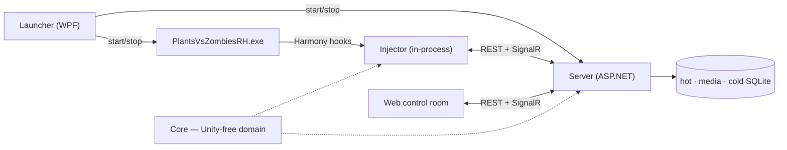

<div align="center">


<br>

[](LICENSE) [](https://github.com/letuhao/plant-vs-zombie-rise-of-summoner/actions/workflows/ci.yml) [](#play-it) [](#play-it)

**[What is this?](#a-plants-vs-zombies-fusion-extension)** · **[Features](#what-you-get)** · **[Play it](#play-it)** · **[Roadmap](#roadmap)** · **[Under the hood](#under-the-hood)** · **[Player guide](guide/site/)** · **[Docs](README.md)**

</div>

---

## A Fusion extension

**Play the lawn. Raise creatures. Run idle expeditions. Build the empire. Take back the multiverse.**

Garden Keeper and his Multiverse is an RPG and empire-building extension for **Fusion**. It stays inside Fusion's own world — its plants and zombies, the Garden Keeper, Hourbloom, and the Rotwright — and grows it into a persistent war. Your Fusion matches stay exactly as they are; Garden Keeper and his Multiverse adds the progression, the roster, and the empire around them.

The story picks up where Fusion leaves off. The Rotwright's time machine broke and scattered its shards across the eras. Where a shard landed, plant and zombie fused — and those creatures are yours to raise. You are the Garden Keeper, chasing the Rotwright through the rift with Hourbloom.

The **lawn** is the **first core loop** — souls, levels, almanac, deploy — not the whole war. Idle expeditions run while you play. The rift is adventure and empire: farm, hunt, and defend ground that can fade if you neglect it.

You need a legal install of **Fusion** (a fan-made pack of the host game, separate from EA's official titles). Garden Keeper and his Multiverse never patches or replaces it.

**Win** by finding the Rotwright's fortress and taking it. **Lose** if the homeworld falls. You keep who you are; you lose where you were.

> **The loop:** play the lawn → grow power, summon, and gear → dispatch idle expeditions → farm, hunt, and defend the empire → adventure the map and build the stage → delve and quest → do it again on ground that fights back.

Short feature list: **[docs/guide/features.md](guide/features.md)**. Tabbed vision site: **[docs/guide/site/](guide/site/)**. Full vision and named loops: **[player guide](guide/)**.

---

## How the war is played

You start on the **lawn** — a normal Fusion match. You raise creatures. You send spare creatures on **expeditions**. When you are ready, you step onto the **rift**: adventure on the map, empire on the world stage, crawls in delves, quests tying it together.

- Kills become souls; encounters fill the almanac; creatures you raised deploy back onto the board
- Summon, bind, and fuse at home — gacha is one path, never the only one
- Dispatch idle expeditions with no stamina; march sectors, hold loam, End Turn against the Rotwright
- After the first chapter, unlocked features stay playable with the Fusion game closed

**Same roster, same souls, same world** — whichever place you are playing from. More voice: **[feature list (brief)](guide/features.md)**.

---

## What you get

Everything below is in the current local build. What is still coming lives in the [roadmap](#roadmap).

- **A story that starts on the lawn** — a short Rift prologue frames the fiction; your first win reveals souls and the Garden Keeper's sheet, and the first the Garden Keeper levels open species and your first piece of gear
- **Play the lawn with RPG weight** — six elements, shields, crit, and statuses resolve on every hit; each unit wears a HUD with identity, shield, and statuses
- **Deploy what you raised** — bring roster creatures into a lawn run, and face the creatures the Rotwright has raised for his side
- **Watch it live** — a mirror of the 12×5 board in the control room while a match runs
- **Raise creatures** — persistent specimens; summon at the altar, bind pacts with loyalty and tribute, fuse into stronger forms, pick a patron; wild joins are another way in
- **Build them your way** — the Garden Keeper's level has no cap; free-build aptitudes (you have no class), species builds, aptitude presets, and passive trees
- **Choose who leads** — pick a commander for your next lawn run
- **Idle forever** — expeditions from 30 minutes to 20 hours; recall early, grow slots, no stamina
- **Build the empire** — a world stage with fog, End Turn, legions, loam, and sector buildings; wardens, cede, dowse, lenses, and an outliner for running it; the Rotwright plays his own war from his own fog
- **Remember everything** — an almanac that files what you meet, and a chronicle of every run
- **On your machine** — local control room; no account, no cloud

**[Feature list (brief)](guide/features.md)** · **[Vision site](guide/site/)** · **[Full catalog](guide/#feature-catalog)** (Shipped / WIP / Vision)

<!-- SCREENSHOT SLOT — drop real captures here once you have them, e.g.
     <p align="center">
       
       
     </p>
     Shot list: lawn mirror mid-run · roster with gear · creature codex · world stage · almanac dossier -->

---

## Play it

> ### 🚧 The first packaged build is not cut yet
>
> The stack runs today — it just runs from source. The one-click zip lands with the first tagged release.
> **[⭐ Star or watch the repo](https://github.com/letuhao/plant-vs-zombie-rise-of-summoner)** and GitHub will tell you the moment it does.

### When it ships, playing looks like this

1. Download `FusionRpg-win-x64.zip` from [Releases](https://github.com/letuhao/plant-vs-zombie-rise-of-summoner/releases).
2. Unzip anywhere → double-click **`FusionRpg.Launcher.exe`**.
3. **Browse** to your legal Fusion folder → install **one** loader (BepInEx 6 IL2CPP *or* MelonLoader — never both) → **Play**.

The launcher starts the server, copies the plugin, starts the game, and opens the UI. You do not install Node, npm, a .NET SDK, or the Desktop Runtime.

Your Fusion install stays untouched throughout — no binary patched, no game file written, and uninstalling is deleting a folder. Builds are unsigned hobby builds, so read the **Trust & security** panel on first run — [the player runbook](runbook/players.md) explains exactly what your antivirus is likely to say and why.

### Running it from source, right now

```powershell
# Windows · .NET 8 (+ .NET 6 for the injector) · Node 22
$env:FUSIONRPG_GAME_DIR = "<your game folder — the one with PlantsVsZombiesRH.exe>"

dotnet test tests\FusionRpg.Core.Tests     # prove the domain
python scripts\deploy-play.py                  # guards → injector → server → game → browser
```

Want the RPG without the game? Run `python scripts\deploy-play.py --no-game` and open `http://127.0.0.1:5088`.

Full setup: [docs/contributing/dev-setup.md](contributing/dev-setup.md) · [docs/runbook/local-dev.md](runbook/local-dev.md)

---

## Roadmap

Status SSOT for every named feature: **[player guide catalog](guide/#feature-catalog)**. This list is a thin mirror — not a second schedule.

**Shipped**

Rift prologue and first-session checkpoints · live lawn mirror and unit HUD · RPG combat on the lawn (six-element ring, shields, crit, statuses) · your creatures and the Rotwright's creatures deployed onto the lawn · summon, pacts, loyalty, tribute, fusion, patron · expeditions (idle forever) · free-build aptitudes, species builds, aptitude presets, passive trees · commanders · world stage, End Turn, fog, the Rotwright, loam, map tools, sector buildings · almanac and chronicle · hot / media / cold persistence

**In the forge**

Interactive turn-based battles · the Delve (stage built; domains to enter are next) · the siege board (assaults resolve on the world turn today) · relics armoury and crafting (workbench built; loot sources are next) · skills and loadouts · commander auras · actor meters · build presets beyond aptitudes · map → battle handoff · in-run capture · in-game open button · **the first tagged release**

**Vision (charted)**

Quest log · Keeper-level unlock chapters · enemy counter-development · failure branches · named combat reactions · party formations · three-layer world · world events and deeper fog · lawn blessing and trophies

Nothing on this list is a promise with a date attached. It is one person's build order, and it moves.

---

## Under the hood

<details>
<summary><b>The architecture in one paragraph</b> — click to expand</summary>

<br>

A WPF **Launcher** starts a legal Fusion install with a Harmony **Injector** inside it and an independent **Server** (SQLite + REST + SignalR) beside it. A React **Web** control room, served from the server's own `wwwroot`, observes everything and issues commands. The injector never talks to the browser — both talk to the server on `127.0.0.1:5088`.



| Module | Path | Role |
|---|---|---|
| **Launcher** | `gk-fusion/src/FusionRpg.Launcher` | Player entry — loader install, port pick, start game + server, self-update |
| **Injector** | `gk-fusion/src/FusionRpg.Injector` (+ BepInEx / MelonLoader hosts) | Harmony hooks, capture, guarded apply |
| **Core** | `gk-core/src/FusionRpg.Core` | Stats, actor hub, statuses, elements, combat, effects, actions, world, match runtime — **no Unity** |
| **Data** | `gk-core/src/FusionRpg.Data` | The only place SQL exists |
| **Server** | `gk-core/src/FusionRpg.Server` | REST, SignalR, ingest, battle engine, static SPA — **no SQL** |
| **Contracts** | `gk-core/src/FusionRpg.Contracts` | Shared DTOs across every boundary |
| **CheatCore** | `gk-core/src/FusionRpg.CheatCore` | Cheat schema, identity/strip rules, codec |
| **Web** | `gk-web/web/fusion-rpg-web` | Vite + React + Phaser control room |

</details>

<details>
<summary><b>The one rule everything hangs off</b></summary>

<br>

**Fusion stays the source of truth for physics, vanilla combat, entity lifetime, and current HP.** Every RPG feature lives in the RPG layer, never in a change to what Fusion is. The overlay only ever does two things:

1. **Projects** Unity outward through Harmony capture — events → server → SQLite → browser.
2. **Mutates** Unity through a tiny set of guarded paths and nothing else: `EntityStatWriter` for stats, the CC executor for statuses, the effect Funnel for HP deltas, `pvz.*` intents for spawns.

Two state machines, no shared state, only messages. That is why the frame rate survives an RPG stapled to it, and why a bug in the overlay cannot corrupt your game.

Guard scripts enforce it on every CI run and every local deploy — among them:

```text
python gk-fusion/scripts/guard-single-writer.py   # combat writes only via EntityStatWriter
.\scripts\guard-secondary-no-unity.py  # gameplay plugins stay Unity-free
python gk-fusion/scripts/guard-funnel-delta.py    # HP deltas only through the Funnel
python gk-core/scripts/guard-actor-hub.py       # one actor stat compose, no parallel composer
python gk-core/scripts/guard-dal.py             # SQL only inside FusionRpg.Data
```

Every principle, standard, and game rule on one page: **[docs/PRINCIPLES.md](PRINCIPLES.md)**.

</details>

<details>
<summary><b>Is it actually tested?</b></summary>

<br>

| | |
|---|---|
| **C# test projects** | Core, Data, Server, Guard, Launcher, CheatCore, E2E, and the content tools — run on every CI build |
| **Web tests** | Vitest + Testing Library, Playwright end-to-end |
| **Architectural guards** | Run in CI *and* on every local deploy |
| **Golden files** | Damage math, element matchups, battle resolution, world turns |
| **Generated content** | Committed and checked for drift on every CI run |
| **Mutation testing** | `gk-core/scripts/mutate.py` — a covered line asserted by nothing is worth nothing |

Deterministic by design: battles resolve from recorded seeds, the world steps behind a command barrier, and replays are byte-comparable. That is not a testing convenience — it is what lets a save survive a version bump.

</details>

<details>
<summary><b>Safety, fair play, and what this thing is not</b></summary>

<br>

**Does it modify my game?** No. It never downloads, patches, or writes to the game binary. It installs a loader you choose, into a folder you point at, from that loader's official GitHub release. Uninstalling is deleting the plugin folder.

**Do I need a legal copy?** Yes. Game content is not part of this project and is not covered by its license.

**Is my save safe?** The RPG keeps its own databases next to the server executable. Updating the extension preserves them and never touches Fusion's saves.

**Is this a cheat menu?** There is a sandbox page, because you cannot build a stat overlay without being able to set stats. It is single-player, local-only, and off by default — leave it alone and the Fusion lawn plays exactly as shipped.

**Multiplayer?** No. Localhost only. No auth, no telemetry, no network traffic beyond your own machine.

**Which game version?** Built and proven against Fusion 3.8.1; the MelonLoader host tracks 3.9.

</details>

---

## Read the docs

The docs are the design record, not an afterthought — architecture decisions, subsystem sources of truth, research notes, and the reasoning trails behind the things that got cut.

| Start here | For |
|---|---|
| [docs/guide/](guide/) | **Player guide** — [vision site](guide/site/), [brief feature list](guide/features.md), [mechanisms](guide/mechanisms/), loops, full catalog |
| [docs/PRINCIPLES.md](PRINCIPLES.md) | **Every rule on one page** — engineering standards, invariants, and game business rules |
| [docs/README.md](README.md) | The whole map |
| [architecture/software-architecture.md](architecture/software-architecture.md) | The system on one page — modules, hot path, invariants, FSMs |
| [architecture/data-architecture.md](architecture/data-architecture.md) | Every store and table, who owns what, hot → cold lifecycle |
| [architecture/decisions.md](architecture/decisions.md) | The locked choices, and why |
| [docs/DESIGN-GATE.md](DESIGN-GATE.md) | Read this before proposing anything |

---

## Contributing

Issues, ideas, and playtest reports are all welcome — especially playtest reports, because the lawn does things no offline test can see.

Start at [CONTRIBUTING.md](../CONTRIBUTING.md), then [docs/PRINCIPLES.md](PRINCIPLES.md) and [dev-setup.md](contributing/dev-setup.md). PRs want a short test plan. Anything that locks behavior in goes through [decisions.md](architecture/decisions.md) first. Be decent to each other: [CODE_OF_CONDUCT.md](../CODE_OF_CONDUCT.md) · [SECURITY.md](../SECURITY.md) · [SUPPORT.md](../SUPPORT.md).

---

<div align="center">

**Garden Keeper and his Multiverse** is the player-facing name. `FusionRpg` is the internal prefix on every assembly, env var, and release zip — same project, two names.

Licensed under [AGPL-3.0-or-later](LICENSE) · Windows only · Bring your own legal copy of Fusion

Built by fans of Fusion, for fans of Fusion. All credit for the lawn itself belongs to the people who made it.

<sub>The host game and its characters are the property of their respective owners. The fan-made pack is an independent work. This is an unofficial, non-commercial fan project, not affiliated with or endorsed by PopCap, Electronic Arts, or the Fusion authors.</sub>

</div>
